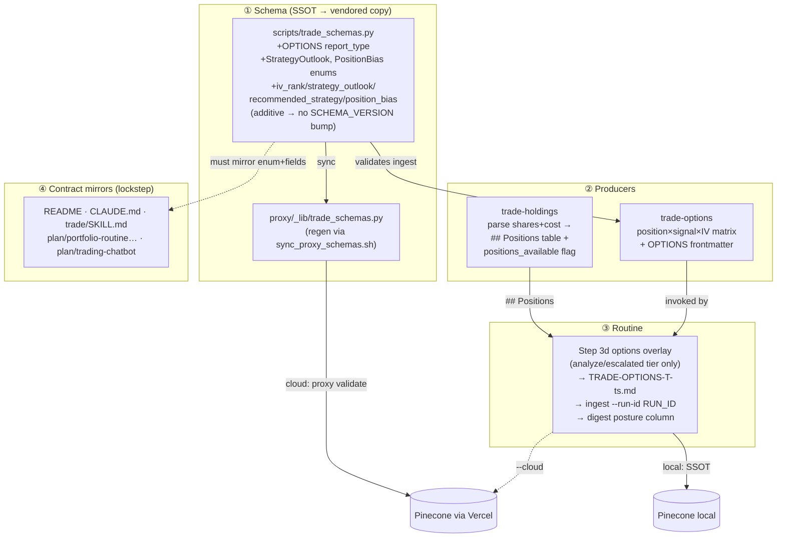

# Options Strategy in the Portfolio Routine + Pinecone

> **For agentic workers:** REQUIRED SUB-SKILL — use superpowers:subagent-driven-development (recommended) or superpowers:executing-plans to implement task-by-task. Steps use `- [ ]` checkboxes.
> **On execution, also copy this plan to** `docs/superpowers/plans/2026-06-07-options-strategy-portfolio.md` (plan-mode confined it to `~/.claude/plans/`).

## Context

`/trade options <ticker>` is today a rich but **isolated, manual** command. It analyzes one ticker's IV/flow and lists strategies for a *hypothetical* outlook, but it (1) never checks whether the user **holds** the position — so it can't choose covered-call vs protective-put vs cash-secured-put on real footing; (2) emits **no frontmatter** — so the report can't enter Pinecone; (3) produces **no structured posture** a consumer could filter on; and (4) is **wired into nothing** — the daily routine and `/trade analyze` ignore it. Holdings are parsed ticker-only (`skills/trade-holdings/SKILL.md:120-127` extracts symbols and discards quantities), so there's no position context to drive strategy selection.

The user wants options to be a first-class part of the portfolio loop — **manage, grow, hedge** — with reports landing in Pinecone alongside analysis records. Settled decisions: gate routine options to **analyze-tier holdings only** (bounded by the existing escalation cap); **parse share counts from Drive** for true sizing (degrade to a held-flag when absent); persist **structured fields** (not just full text) so consumers can filter on posture.

**Outcome:** `/trade routine` writes a `TRADE-OPTIONS-<T>-<ts>.md` for every analyze-tier holding, ingests it under the sweep's `run_id` as an `OPTIONS` record, and surfaces the posture in the digest; `/trade options` standalone becomes position- and signal-aware.

## Shape of the change



**Critical sequencing:** local/workstation ingest works the moment Task 1 lands (uses the SSOT directly). **Cloud** ingest of OPTIONS is rejected by the proxy (`proxy/_lib/validate.py` re-validates with `extra="forbid"`) until Task 2's synced copy is **merged to main and Vercel redeploys**. So Task 7 Step 5 (cloud E2E) runs only after merge+deploy.

## Cross-file contracts touched (verified present)

- **Schema is duplicated:** `scripts/trade_schemas.py` (SSOT, `extra="forbid"` at line 118) → `proxy/_lib/trade_schemas.py` (bit-identical via `scripts/sync_proxy_schemas.sh` — confirmed `cp`+`diff` guard). Never hand-edit the proxy copy.
- **Additive only:** new enum value + optional fields → **no `SCHEMA_VERSION` bump** (rule at `trade_schemas.py:15-18`; README "increments on breaking changes only").
- **`report_type` enum mirrored in 6 places:** SSOT (`trade_schemas.py:66-77`), proxy copy, `README.md` (ID-scheme list **line 380** + field table **line 398**), and `plan/portfolio-routine-and-vector-memory.md` (comma list ~486, enum ~542, example comment ~576, **availability matrix ~594-604**) + `plan/trading-chatbot.md`.
- **No install-list change:** `trade-options`, `trade-holdings`, `trade-routine` already in `install.sh`/`uninstall.sh` (no new skill/agent files).
- **trade_memory.py command surface confirmed:** `ingest --archive --run-id`, top-level `--namespace`, `latest --type`, `timeline`, `query` all exist.
- Disclaimer + "cite real numbers / say 'Data not available'" mandate applies to every options report.

---

## Task 1 — Schema: OPTIONS report_type, enums, structured fields

**File:** `scripts/trade_schemas.py`

- [ ] **Step 1 — failing check (must error now):**
```bash
python3 -c "
import sys; sys.path.insert(0,'scripts'); import trade_schemas as s
r = s.RecordMetadata(ticker='AAPL', report_type='OPTIONS',
  generated_at='2026-06-07T12:00:00-07:00', iv_rank=62,
  strategy_outlook='INCOME', recommended_strategy='Covered Call',
  position_bias='LONG', signal='HOLD'); print('OK', r.report_type)"
```
Expected: `ValidationError`.

- [ ] **Step 2 — add `OPTIONS = "OPTIONS"`** to `ReportType` (after `QUICK`, line 76).

- [ ] **Step 3 — add two enums** immediately after the `Grade` enum (line 63), before the allowlist section:
```python
class StrategyOutlook(str, Enum):
    """Options posture on an OPTIONS report — the 'manage/grow/hedge' framing.
    INCOME = premium on an existing position (covered call, CSP).
    HEDGE  = downside protection (protective put, collar).
    BULLISH/BEARISH/NEUTRAL = directional/non-directional debit/credit plays."""
    BULLISH = "BULLISH"
    BEARISH = "BEARISH"
    NEUTRAL = "NEUTRAL"
    INCOME = "INCOME"
    HEDGE = "HEDGE"


class PositionBias(str, Enum):
    """The holder's existing stock position that conditioned the strategy.
    Holdings yields only LONG / FLAT (InvestmentSummary has no shorts).
    Routine OPTIONS reports are always LONG; a manual /trade options on an
    unheld name is FLAT."""
    LONG = "LONG"
    FLAT = "FLAT"
```

- [ ] **Step 4 — add four optional fields** to `RecordMetadata`, after `thesis_score` (line 137), before `# Derived labels`:
```python
    # Options posture (OPTIONS report_type only; all optional & additive)
    iv_rank: Optional[int] = Field(default=None, ge=0, le=100)
    strategy_outlook: Optional[str] = None      # validated against StrategyOutlook
    recommended_strategy: Optional[str] = None  # primary strategy name (free text)
    position_bias: Optional[str] = None          # validated against PositionBias
```

- [ ] **Step 5 — add two validators** after `_grade_value` (line 211), before `_id_format`. Mirror the existing `_signal_uppercase` shape (None→None, else membership check raising `ValueError`): `_strategy_outlook_value` against `{o.value for o in StrategyOutlook}`, `_position_bias_value` against `{p.value for p in PositionBias}`.

- [ ] **Step 6 — extend the self-test** (after the `Grade values:` print, line 288):
```python
    print(f"StrategyOutlook:   {sorted(o.value for o in StrategyOutlook)}")
    print(f"PositionBias:      {sorted(p.value for p in PositionBias)}")
```

- [ ] **Step 7 — verify:** `python3 scripts/trade_schemas.py` prints schema, `SCHEMA_VERSION = 1`, `OPTIONS` in ReportType, the two new enum lines. Re-run Step 1 snippet → `OK OPTIONS`.

- [ ] **Step 8 — negative check** (bad enums/range still rejected):
```bash
python3 -c "
import sys; sys.path.insert(0,'scripts'); import trade_schemas as s
for bad in [dict(strategy_outlook='MOON'), dict(position_bias='SHORTISH'), dict(iv_rank=150)]:
    try: s.RecordMetadata(ticker='AAPL', report_type='OPTIONS', generated_at='2026-06-07T12:00:00-07:00', **bad); print('FAIL', bad)
    except Exception: print('OK rejected', list(bad)[0])"
```
Expected: three `OK rejected …`.

- [ ] **Step 9 — commit:** `feat(schema): add OPTIONS report_type + iv_rank/strategy_outlook/recommended_strategy/position_bias fields`

## Task 2 — Sync vendored proxy schema

**File (generated):** `proxy/_lib/trade_schemas.py`

- [ ] **Step 1:** `bash scripts/sync_proxy_schemas.sh` → expect `✓ synced … (bit-identical)`.
- [ ] **Step 2 — proxy boundary knows the fields:**
```bash
python3 -c "
import sys; sys.path.insert(0,'proxy/_lib'); import trade_schemas as s
assert {'iv_rank','strategy_outlook','recommended_strategy','position_bias'} <= set(s.RecordMetadata.model_fields)
assert 'OPTIONS' in {t.value for t in s.ReportType}; print('proxy schema OK')"
```
- [ ] **Step 3:** `diff -q scripts/trade_schemas.py proxy/_lib/trade_schemas.py && echo IDENTICAL`.
- [ ] **Step 4 — commit:** `chore(proxy): sync vendored schema (OPTIONS + options fields)`

> **Deployment note (not a code step):** cloud routine ingests through the deployed proxy; OPTIONS records 422 until this commit is **merged to main + Vercel redeploys**. Local ingest works after Task 1. Sequence Task 7 Step 5 after merge+deploy.

## Task 3 — Holdings: parse share counts (degrade to held-flag)

**File:** `skills/trade-holdings/SKILL.md`

- [ ] **Step 1 — extend PHASE 2 extraction** (after the ticker-grammar rules, ~line 133) with a new rule 6: capture **shares** (columns `Shares`/`Quantity`/`Qty`/`Units`/`Position`, or the second token in inline `AAPL 100`; strip commas, accept fractional) and optional **cost basis** (`Cost`/`Avg Cost`/`Cost Basis`/`Book Value`/`Price Paid`/`Avg Price`). Pair each with its row's ticker; SUM shares when a ticker spans accounts (share-weight cost basis if both present, else null). **Graceful degradation:** columns are often absent (the default master is `.xlsm` → docx fallback, frequently ticker-only) — record `shares: null`, **never invent**; a held ticker with unknown size is still LONG.

- [ ] **Step 2 — PHASE 3 output** (cache template ~lines 156-176): add `positions_available: <true|false>` to frontmatter (true if ≥1 ticker has a parsed share count) and a `## Positions` table **after** `## Tickers`:
```markdown
   ## Positions

   | Ticker | Shares | Cost Basis |
   |--------|--------|------------|
   | AAPL | 100 | 150.00 |
   | DIVO | — | — |
```
Add one sentence: *"`## Positions` is additive — the routine still reads `## Tickers` for the sweep loop and only consults `## Positions` (when present) for options sizing. Use `—` for unknown shares/cost."* This template feeds **both** the CWD file and the `~/.claude/trade/TRADE-HOLDINGS.md` cache (step 4 there).

- [ ] **Step 3 — add Rule 8** (Rules list ~line 331): *"NEVER fabricate share counts or cost basis. Use `—`/null when absent. A held ticker with unknown size is LONG-unknown, not FLAT."*

- [ ] **Step 4 — verify:** `./install.sh >/dev/null && echo installed`; in a session run `/trade holdings`, confirm `~/.claude/trade/TRADE-HOLDINGS.md` has a `## Positions` table + `positions_available:` and shows `—` (not invented numbers) for ticker-only rows. (Manual — no harness for Drive-backed skills.)

- [ ] **Step 5 — commit:** `feat(holdings): parse share counts + cost basis into a Positions table (held-flag fallback)`

## Task 4 — Options skill: position-aware, signal-aware, ingestable

**File:** `skills/trade-options/SKILL.md`

- [ ] **Step 1 — accept context in Activation** (after line 20). New "Position & Signal Context (optional, passed by the routine)" subsection: honor inline context when present, else self-discover.
  - `POSITION_BIAS` = `LONG`/`FLAT`. Routine: always `LONG`. Manual: read `~/.claude/trade/TRADE-HOLDINGS.md` → in `## Tickers` ⇒ LONG, else FLAT.
  - `POSITION_SHARES` = integer or `unknown`, from `## Positions` when `positions_available: true`, else `unknown`.
  - `ANALYZE_SIGNAL` (`STRONG BUY`…`AVOID`) + `COMPOSITE_SCORE` (0-100), from the routine's just-completed analyze; manual may fetch via `trade_memory.py latest <T> --type ANALYSIS` (best-effort, null OK).
  - `RUN_ID` = sweep id to stamp (routine only).
  - A positional `bullish/bearish/neutral` arg overrides the signal-derived outlook for strategy *filtering*, but `strategy_outlook`/`position_bias` still reflect reality.

- [ ] **Step 2 — decision matrix** at the top of "Strategy Selection Logic" (~line 100, above the existing directional tables, which stay as the strategy reference). Pick the PRIMARY from this, then fill 3 alternates from the directional tables:

| Position | Composite signal | IV environment | Primary strategy | `strategy_outlook` | Intent |
|----------|------------------|----------------|------------------|--------------------|--------|
| LONG | STRONG BUY / BUY | High IV (rank ≥50) | Covered Call (OTM) | INCOME | grow + income, keep upside |
| LONG | STRONG BUY / BUY | Low IV (rank <50) | Hold / Call Diagonal | BULLISH | grow, don't cap a cheap-IV runner |
| LONG | HOLD / NEUTRAL | High IV | Covered Call (near-ATM) | INCOME | harvest elevated premium |
| LONG | HOLD / NEUTRAL | Low IV | Collar (costless-ish) | HEDGE | cheap protection |
| LONG | CAUTION / AVOID | any | Protective Put or Collar | HEDGE | hedge a weakening name |
| FLAT | STRONG BUY / BUY | High IV | Cash-Secured Put | INCOME | get paid to enter |
| FLAT | STRONG BUY / BUY | Low IV | Bull Call Spread / Long Call | BULLISH | cheap directional |
| FLAT | HOLD / NEUTRAL | High IV | Iron Condor / short premium | NEUTRAL | income on range-bound |
| FLAT | CAUTION / AVOID | any | Bear Put Spread or stand aside | BEARISH | defined risk only |

**Sizing:** Covered Call/Collar/Protective Put → contracts = `floor(POSITION_SHARES / 100)`; if `unknown`, say "size to your share count (1 contract per 100 shares)" and invent nothing. CSP/spreads → the existing 1-5% risk-budget guidance. If LONG but `POSITION_SHARES < 100`, covered calls aren't available — fall back to the FLAT row's defined-risk play and say why.

- [ ] **Step 3 — emit frontmatter** (replace the Output Format header block, lines 131-138). File `TRADE-OPTIONS-<TICKER>.md` (routine: `TRADE-OPTIONS-<TICKER>-<YYYYMMDD-HHMM>.md`) MUST begin with:
```markdown
---
trade_report: true
schema_version: 1
ticker: <TICKER>
company: <COMPANY NAME>
report_type: OPTIONS
generated_at: <ISO-8601 with tz>
signal: <inherited ANALYZE_SIGNAL ∈ STRONG BUY|BUY|HOLD|NEUTRAL|CAUTION|AVOID; omit if unknown>
price_at_analysis: <number>
iv_rank: <0-100 int; omit if not found>
strategy_outlook: <BULLISH|BEARISH|NEUTRAL|INCOME|HEDGE>
recommended_strategy: <primary name, e.g. "Covered Call">
position_bias: <LONG|FLAT>
nearest_catalyst_date: <YYYY-MM-DD next earnings if within 60d; else omit>
run_id: <RUN_ID when routine-dispatched; else omit>
---
```
Keep the existing `# Options Analysis…` header + DISCLAIMER below, and add a `**Your Position:** <LONG <shares> shares | LONG (size unknown) | FLAT>` line. Add a rule: *"Omit any frontmatter line whose value is genuinely unavailable rather than writing a placeholder — but `strategy_outlook`, `recommended_strategy`, `position_bias` are always required (decisions, not lookups)."*

- [ ] **Step 4 — add Quality Standard 7** (~line 407): *"Strategy must match position + signal. LONG + CAUTION/AVOID MUST lead with a HEDGE, never a naked income play. FLAT MUST NOT recommend covered calls. The frontmatter MUST match the prose."*

- [ ] **Step 5 — verify ingest** (the real test — `ingest` validates through `RecordMetadata`): re-install, run `/trade options AAPL`, then:
```bash
python3 scripts/trade_memory.py ingest TRADE-OPTIONS-AAPL.md --namespace test-ns
```
Expect records with `report_type=OPTIONS`, ids `AAPL:OPTIONS:<ts>:<section>:0`. A `ValidationError` means the frontmatter is wrong — fix the skill, not the schema. (No `PINECONE_API_KEY` ⇒ validates then reports memory-unavailable; acceptable for schema-correctness.)

- [ ] **Step 6 — commit:** `feat(options): position-aware + signal-aware strategy matrix; emit ingestable frontmatter`

## Task 5 — Routine: options overlay for analyze-tier holdings

**File:** `skills/trade-routine/SKILL.md`

- [ ] **Step 1 — flag + counter.** Add `options: 0` to `TIER_COUNTS` (line 103). In P0 flag-parsing (line 52), document `--no-options` (skip Step 3d entirely; default = overlay runs for every analyze-tier ticker, naturally bounded by the escalation cap).

- [ ] **Step 2 — add Step 3d** after Step 3c (before "Step 4 — Record digest row", line 276). **Capture the timestamp once** to avoid the minute-rollover mismatch between filename and ingest:
```markdown
### Step 3d — Options overlay (analyze-tier tickers only)

Run ONLY when this ticker was processed at the **analyze** or **escalated**
tier this sweep (NOT quick-kept, NOT deferred) and `--no-options` was not
passed. This focuses options on positions that got a fresh full read and
keeps cost bounded by the escalation cap.

1. Resolve position context from `~/.claude/trade/TRADE-HOLDINGS.md`:
   - `POSITION_BIAS=LONG` (every routine ticker is a holding).
   - If the cache has `positions_available: true` and a `## Positions` row for
     `$T` with a numeric Shares value → `POSITION_SHARES=<that number>`; else
     `POSITION_SHARES=unknown`.
2. Reuse the fresh analyze result from Step 3a/3c:
   `ANALYZE_SIGNAL=<new_signal>`, `COMPOSITE_SCORE=<new_score>`.
3. Capture one timestamp for this overlay:
   `OPTS_TS=$(date +%Y%m%d-%H%M)`
4. In the LLM context, invoke `/trade options $T` passing POSITION_BIAS,
   POSITION_SHARES, ANALYZE_SIGNAL, COMPOSITE_SCORE, RUN_ID=$RUN_ID. The
   trade-options skill writes `TRADE-OPTIONS-$T-$OPTS_TS.md` with OPTIONS
   frontmatter.
5. Ingest non-fatally (mirrors the QUICK ingest in Step 3b):
   ```bash
   python3 ~/.claude/skills/trade/scripts/trade_memory.py \
       ingest "TRADE-OPTIONS-${T}-${OPTS_TS}.md" \
       --archive --run-id "$RUN_ID" || true
   ```
6. `TIER_COUNTS.options++`. Capture `recommended_strategy` + `strategy_outlook`
   from the report's frontmatter for the digest row.

If `/trade options` fails or returns no usable strategy, log
`[warn] $T: options overlay skipped (<reason>)` on stderr and continue — the
overlay is supplementary and MUST NOT fail the sweep.
```

- [ ] **Step 3 — digest row** (Step 4 ~line 288): add `options_strategy: <recommended_strategy or null>` and `options_outlook: <strategy_outlook or null>`.

- [ ] **Step 4 — digest frontmatter + table.** After `deferred_count` (line 309) add `options_count: <TIER_COUNTS.options>`. In the Per-Ticker Results table (~325-331) add an `Options` column showing `<outlook>: <strategy>` (e.g. `INCOME: Covered Call`) or `—` when the overlay didn't run; update the example rows.

- [ ] **Step 5 — cloud digest** (`--cloud` branch, Slack body assembly ~line 414): add a one-line-per-actionable-ticker **Options posture** block (only tickers where the overlay ran), inside the existing ≤3000→message / >3000→canvas size branch:
```
Options posture (analyze-tier):
  • AAPL — INCOME / Covered Call
  • MARA — HEDGE / Protective Put
```

- [ ] **Step 6 — verify on one ticker:** re-install; run `/trade routine --max-escalations 1` against holdings whose first ticker analyzes. Confirm `TRADE-OPTIONS-<T>-<ts>.md` written+ingested; `TRADE-ROUTINE-<ts>.md` shows `options_count: 1`, Options column populated for that ticker and `—` for quick-tier ones. Then `python3 scripts/trade_memory.py timeline <T> | grep -i options` → the OPTIONS record under the sweep `run_id`.

- [ ] **Step 7 — commit:** `feat(routine): options overlay for analyze-tier holdings; digest posture + options_count + --no-options`

## Task 6 — Documentation & contract mirrors

**Files:** `README.md`, `CLAUDE.md`, `trade/SKILL.md`, `plan/portfolio-routine-and-vector-memory.md`, `plan/trading-chatbot.md`

- [ ] **Step 1 — README enums:** append `/ OPTIONS` to the ID-scheme list (**line 380**) and the field-table `report_type` row (**line 398**).
- [ ] **Step 2 — README fields:** after `thesis_score` (**line 406**) add four rows:
```markdown
| `iv_rank` | int (0–100) | OPTIONS | Implied-vol rank; null on non-options reports |
| `strategy_outlook` | enum | OPTIONS | `BULLISH` / `BEARISH` / `NEUTRAL` / `INCOME` / `HEDGE` |
| `recommended_strategy` | string | OPTIONS | Primary strategy name (free text, e.g. `Covered Call`) |
| `position_bias` | enum | OPTIONS | `LONG` / `FLAT` — holder's stock position that conditioned the strategy |
```
Note in the preamble that these are additive (no `schema_version` bump).
- [ ] **Step 3 — CLAUDE.md:** in the Pinecone-schema bullet, record OPTIONS + the 4 fields as additive (no bump), that `sync_proxy_schemas.sh` must run after editing the SSOT, and **the proxy must redeploy before cloud OPTIONS ingest works**. In Architecture, note the routine's analyze-tier options overlay (`TRADE-OPTIONS-<TICKER>-<ts>.md`).
- [ ] **Step 4 — trade/SKILL.md:** update the `/trade options` description to "Options strategy — position-aware (covered call vs protective put vs CSP) and signal-aware; runs standalone or as the routine's analyze-tier overlay; report → Pinecone." Keep filename `TRADE-OPTIONS-[TICKER].md`.
- [ ] **Step 5 — plan-doc mirrors (all four spots in `portfolio-routine-and-vector-memory.md` + chatbot):**
  - comma field-list (~486-488) — add the 4 field names;
  - field-contract `report_type` enum (~542) — append `/ OPTIONS`;
  - example-frontmatter comment (~576) — append `|OPTIONS`;
  - **"Field availability by report_type" matrix (~594-604)** — add an `OPTIONS` column (✓ for the 4 new fields + `signal`/`price_at_analysis`/`nearest_catalyst_date`/`run_id`, ✗ for the score columns) and rows for the 4 new fields;
  - `plan/trading-chatbot.md` "Required metadata fields" table — add OPTIONS + the 4 fields.
- [ ] **Step 6 — verify parity:**
```bash
python3 -c "import sys; sys.path.insert(0,'scripts'); import trade_schemas as s; print(sorted(t.value for t in s.ReportType)); print({'iv_rank','strategy_outlook','recommended_strategy','position_bias'} <= set(s.RecordMetadata.model_fields))"
grep -c "OPTIONS" README.md
```
Expect OPTIONS listed, `True`, grep ≥ 3.
- [ ] **Step 7 — commit:** `docs: document OPTIONS report_type, options fields, and routine overlay across the contract mirrors`

## Task 7 — Install + end-to-end verification

- [ ] **Step 1:** `./install.sh` — trade-options/-holdings/-routine + scripts copy without error (no install-list change needed).
- [ ] **Step 2 — LONG path:** after `/trade holdings`, `/trade options AAPL` (held) → header `Your Position: LONG …`, primary is income/hedge (not a FLAT-only play), frontmatter has `position_bias: LONG` + `strategy_outlook` + `recommended_strategy`.
- [ ] **Step 3 — FLAT path:** `/trade options NVDA` (not held) → `position_bias: FLAT`, no covered call, a defined-risk directional/CSP primary.
- [ ] **Step 4 — local round-trip:**
```bash
python3 scripts/trade_memory.py ingest TRADE-OPTIONS-AAPL.md --namespace test-ns
python3 scripts/trade_memory.py query "covered call income strategy" --namespace test-ns | head
```
Expect ingest OK + the OPTIONS chunk(s). (Clean "memory unavailable" skip OK if no `PINECONE_API_KEY` — Task 4 Step 5 proved schema-correctness.)
- [ ] **Step 5 — cloud E2E (AFTER merge to main + proxy redeploy):** trigger one routine run; confirm the Slack digest shows the Options posture block + `options_count > 0`, then from the workstation:
```bash
set -a; source .env; set +a
curl -sS -X POST "$PINECONE_PROXY_URL/query" \
  -H "Authorization: Bearer $PINECONE_PROXY_TOKEN" \
  -H "x-vercel-protection-bypass: $VERCEL_PROTECTION_BYPASS" \
  -H "Content-Type: application/json" \
  -d '{"namespace":"trade","text":"options strategy","top_k":3,"filter":{"report_type":{"$eq":"OPTIONS"}}}'
```
Expect ≥1 hit with `report_type: OPTIONS`, today's `generated_date`, the sweep `run_id`. A 422 means the proxy wasn't redeployed with the synced schema — re-check Task 2's note.

---

## Self-review

- **Spec coverage:** analyze options for tickers → Task 4 + Task 5 overlay; validate correct strategy from investment summary + market conditions → Task 3 positions + Task 4 position×signal×IV matrix; reports into Pinecone → Task 1/2 schema + Task 4 frontmatter + Task 5 ingest; manage/grow/hedge → `strategy_outlook` enum mapped in the matrix.
- **Additive-only:** new enum value + optional fields → no `SCHEMA_VERSION` bump; existing readers ignore unknown fields.
- **Proxy/cloud ordering:** local works at Task 1; cloud needs Task 2 sync + merge + redeploy before Task 7 Step 5.
- **Graceful degradation:** unknown shares → held-flag LONG (never fabricated); missing IV → omit `iv_rank`; overlay failure non-fatal to the sweep.
- **Robustness fix:** routine captures `OPTS_TS` once (Step 3d) so the filename and ingest call can't drift across a minute boundary — the existing QUICK ingest has this latent risk; the new overlay avoids it.
- **No new install-list entries** (no new skill/agent files).
